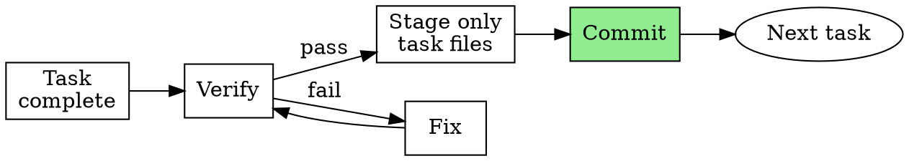

# Surgical Commits

## Overview

One task = one commit. Commit immediately. Never combine.

**Core principle:** Every commit is surgical, traceable, and independently revertable.

**Violating the letter of this rule is violating the spirit of this rule.**

**Note:** Respect your platform's git safety rules. Do not commit unless the active workflow permits it.

**Announce at start:** "I'm using the surgical-commits skill to commit this work."

## When to Use

**Always after:**
- Completing any task from a plan
- Any code change that passes verification
- Fixing reviewer feedback (separate commit from original work)

**Never combine:**
- Multiple tasks in one commit
- Unrelated changes with related changes
- Fix + feature in one commit

## The Iron Law

```
ONE TASK = ONE COMMIT. NO EXCEPTIONS.
```

If you have changes from two tasks staged, STOP. Unstage. Commit separately.

## Commit Timing



1. Complete the task
2. Run verification (use superpowers:verification-before-completion)
3. Stage ONLY files related to this task
4. Commit with format below
5. Move to next task

**Commit before moving on.** Not after. Not later. Not in a batch.

## Commit Message Format

### Plan-based work

```
<type>(<phase>-<task>): <description>

[optional body explaining what and why]
```

Where:
- `type`: feat | fix | docs | test | refactor | chore
- `phase`: Two-digit phase number from plan (e.g., 01, 02)
- `task`: Two-digit task number within phase (e.g., 01, 02, 03)
- `description`: Imperative mood, lowercase, no period, max 50 chars

### Ad-hoc work (outside a plan)

```
<type>: <description>

[optional body explaining what and why]
```

No phase/task number needed for ad-hoc changes.

### Examples

```
feat(02-01): add user registration endpoint
test(02-01): add integration tests for registration
fix(02-02): handle duplicate email gracefully
docs(02-03): document registration API in OpenAPI spec

chore: update dependency versions
fix: correct typo in error message
refactor: extract validation into helper
```

## Pre-Commit Verification

Before running `git commit`, verify:

1. **Tests pass** — run the test suite (or relevant subset)
2. **Only task files staged** — `git diff --cached --name-only` shows only files for this task
3. **No unrelated changes** — `git diff` shows only intentionally deferred work, not forgotten files
4. **Commit message follows format** — type, scope (if plan-based), description

```bash
# Verify what's staged
git diff --cached --name-only

# Verify what's NOT staged (should be empty or intentionally deferred)
git diff --name-only

# Commit
git commit -m "<type>(<phase>-<task>): <description>"
```

## Red Flags — STOP

- About to commit changes from multiple tasks
- Staged files you didn't touch in this task
- Commit message says "and" (sign of multiple changes)
- "I'll commit everything at the end"
- Changes from reviewer feedback mixed with original work
- Thinking "this is too small for its own commit"
- Unrelated formatting/cleanup changes included

**All of these mean: Unstage. Split. Commit separately.**

## Rationalization Prevention

| Excuse | Reality |
|--------|---------|
| "These changes are related" | Related ≠ same task. One task, one commit. |
| "It's just a small fix alongside" | Small fixes get their own commit. |
| "I'll split them later" | You won't. Commit now. |
| "Too many small commits clutters history" | Small commits = clear history. Big commits = hidden changes. |
| "Reviewer feedback is part of the original task" | Reviewer fixes = separate commit. Shows what review caught. |
| "I forgot to commit earlier" | Unstage everything. Stage task-by-task. Commit each. |
| "Nobody cares about commit history" | `git bisect` cares. Future you cares. Revert-ability cares. |
| "This is too small for its own commit" | If it's a change, it's a commit. Size doesn't matter. |

## Why This Matters

- **`git bisect`** finds the exact failing task
- **Revert-ability** — each task independently revertable
- **Traceability** — commit message maps to plan task
- **Observability** — clear history for future sessions and code review
- **Accountability** — every change has a purpose and a scope

## Integration

**Pairs with:**
- **superpowers:verification-before-completion** — Run verification BEFORE each commit
- **superpowers:test-driven-development** — TDD cycle produces natural commit points

**Natural fit for:**
- **superpowers:executing-plans** — Commit after each task completion
- **superpowers:subagent-driven-development** — Subagents commit after implementing each task

**Followed by:**
- **superpowers:finishing-a-development-branch** — After all commits, wrap up the branch
